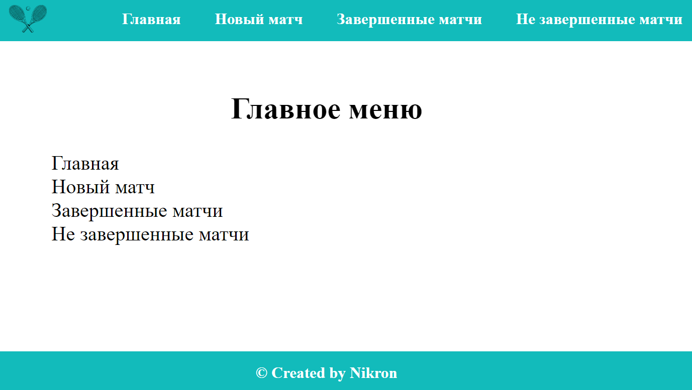
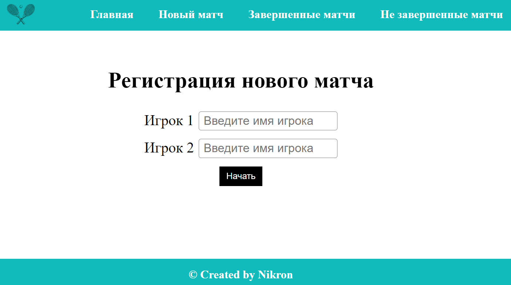
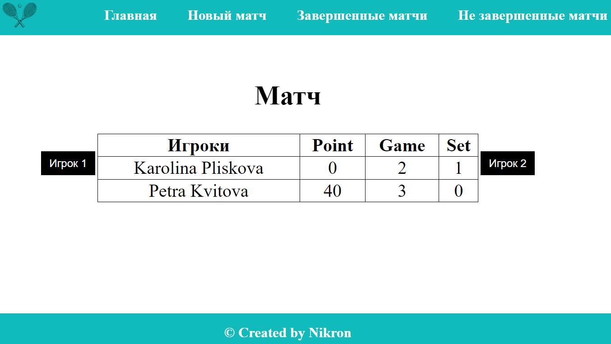
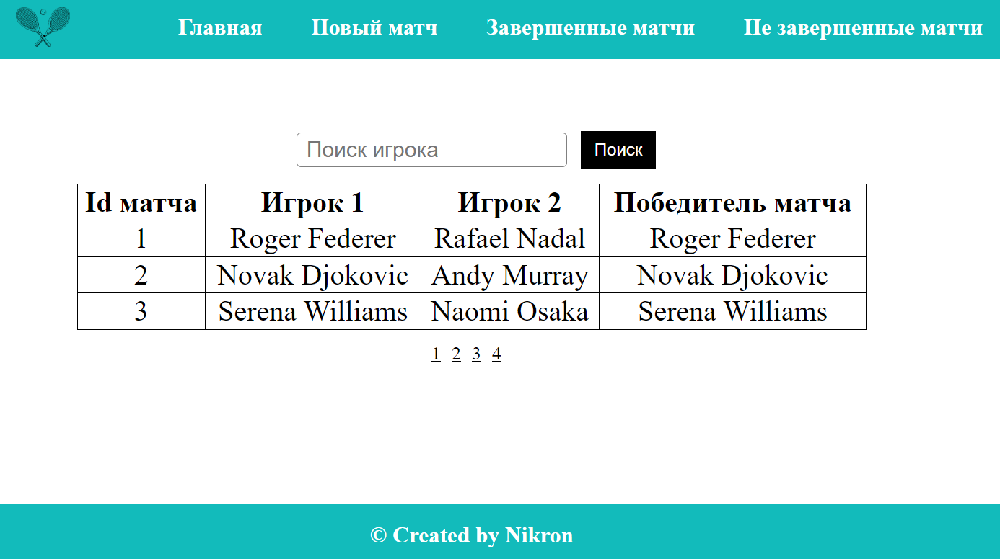

# Проект “табло теннисного матча”

Веб-приложение, реализующее табло счёта теннисного матча.

## Используемые технологии:

• Maven

• Hibernate

• JUnit5

• H2 database

• Java Servlets

• Apache Tomcat

• JSP, JSTL

• HTML, CSS

Описание задания: https://zhukovsd.github.io/java-backend-learning-course/Projects/TennisScoreboard/